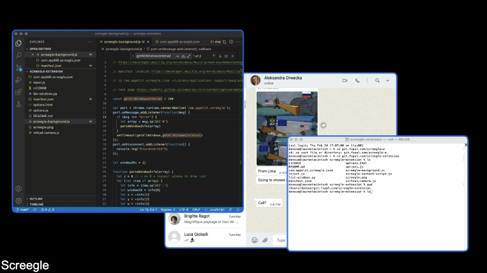

# screegle-extension
Screegle Multiple Window Sharing

# install

- `git clone https://github.com/ldenoue/screegle-extension.git`
- `chmod +x list-windows.py`
- edit `com.appblit.screegle.json` replacing `/Users/denoue/git.fxpal.com/screegle-extension/list-windows.py` with the fullpath of where `list-windows.py` is (where you git clone) 
- `cp com.appblit.screegle.json ~/Library/Application\ Support/Google/Chrome/NativeMessagingHosts/.`

# test

- open `https://webrtc.github.io/samples//src/content/getusermedia/getdisplaymedia/`
- click `Start` and you should see "Screegle" shown in the bottom left corner
- click the S icon of the Screegle extension: it should open the window picker
- pick a window
- the window should appear

Repeat for any new window you'd like to share

# contact

https://twitter.com/ldenoue
